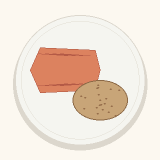

# Nemotron misinterpretation: `salmon_potato.png`

This artefact records an observed online-mode failure case for the VLM step.

## Input

Image:



Expected visual interpretation:

- salmon
- potato

Observed model interpretation:

- sliced ham
- cookie

The image contains a stylized salmon fillet and a potato on a plate, but the configured Nemotron/OpenRouter vision model interpreted the salmon as `sliced ham` and the potato as `cookie`.

## Runtime mode

Observed through the HTMX Web UI:

```text
/ui/analyze-page
```

Mode:

- `Offline Sample Mode`: off
- `Save to History`: on
- VLM model: `nvidia/nemotron-3-nano-omni-30b-a3b-reasoning:free`
- Nutrition source: USDA/provider path

## Observed result

The UI reported `ANALYSIS COMPLETE` because the pipeline successfully processed the model's ingredients and resolved nutrition facts. The issue is not a provider crash; it is an upstream visual recognition error.

Summary:

| Metric | Value |
| --- | ---: |
| Energy | 539 kcal |
| Protein | 19.6 g |
| Carbs | 18.8 g |
| Fat | 6.4 g |

Ingredient rows:

| Ingredient | Portion | kcal | Protein | Carbs | Fat | Status | Source |
| --- | ---: | ---: | ---: | ---: | ---: | --- | --- |
| sliced ham | 85.0 g | 431 | 16.7 g | 2.0 g | 3.1 g | Resolved | USDA |
| cookie | 25.0 g | 108 | 3.0 g | 16.8 g | 3.3 g | Resolved | USDA |

## Why this matters

This is a useful limitation example:

- The system can validate images, call the provider, resolve nutrition, compute totals, and render results correctly.
- However, nutrition totals depend on VLM ingredient recognition quality.

## Expected behavior from the software layer

The software layer behaved as designed:

1. accepted a valid image upload,
2. sent it through the online VLM path,
3. normalized the returned ingredient names and grams,
4. resolved nutrition facts,
5. computed totals,
6. rendered the final table.

The wrong output should be treated as a model limitation, not an application crash.
